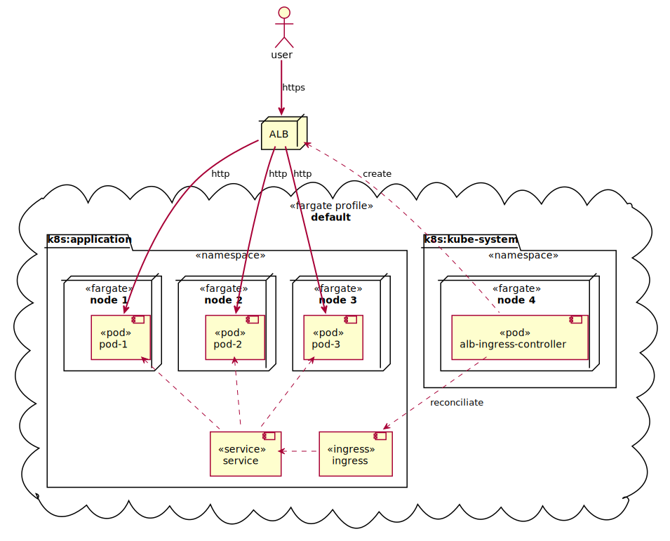

# Simple Go Service on EKS Fargate

## Application

The application is written in Go with the minimal usage of 3rd party libraries. It exposes a single business endpoint `/api/v1/replace`, which accepts a single query param `text` and returns the result string in the response body with `Content-Type: plain/text`

The application also exposes 2 technical endpoints:
- `/health` - a simple indication the service is up
- `/metrics` - application metrics in prometheus format
## Infrastructure

The service is deployed as a standard Kubernetes application into AWS EKS Fargate container-as-a-service infrastructure. EKS Fargate was chosen because of the following advantages:
- it is still Kubernetes and as such can make use of the broad Cloud-Native app ecosystem
- it has the lowest effort to maintain a Kubernetes service on AWS

<!--
@startuml deployment

actor user
node ALB
cloud "default" <<fargate profile>> {
  folder "k8s:application" <<namespace>> {
    node "node 1" <<fargate>> {
      component pod1 <<pod>> [
        pod-1
      ]
    }
    node "node 2" <<fargate>> {
      component pod2 <<pod>> [
        pod-2
      ]
    }
    node "node 3" <<fargate>> {
      component pod3 <<pod>> [
        pod-3
      ]
    }

    component service <<service>>
    component ingress <<ingress>>
  }

  folder "k8s:kube-system" <<namespace>> {
    node "node 4" <<fargate>> {
      component controller <<pod>> [
        alb-ingress-controller
      ]
    }
  }
}

user =down=> ALB : https
ALB ==> pod1 : http
ALB ==> pod2 : http
ALB ==> pod3 : http
service .up.> pod1
service .up.> pod2
service .up.> pod3
ingress .left.> service
controller ..> ingress : reconciliate
controller .up.> ALB : create
	
@enduml
-->

## Deploy to AWS

Requirements:
* terraform 0.15.3+
* aws cli 2.0+
* kubectl 1.19+

All `aws-` commands must be executed in a session with AWS credentials available.
### Bring it up

    make aws-up

### Clean it up

    make aws-tidy

## Run locally with [Tilt.dev](https://docs.tilt.dev/)

### Install

Requires [brew](https://brew.sh/):

    make setup-mac

or later for upgrading to the latest versions:

    make upgrade-mac

### Bring it up

    make local-up

### Clean it up

    make local-tidy
